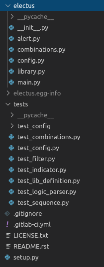

In a [previous blog post](virtualenvs.md) I talked
about how to install/use python virtual environments. These are useful
for managing different versions of installed packages. But what if you
want to install your own packages? Or want to have production and
development editions of your modules? Or want to make your code easily
accessible and installable for co-workers to use? There are many good
reasons to package your python code (and use them with virtual
environments). I\'ll cover the basics of making a pip installable module
(though this only scratches the surface!).

The python packaging authority (pyPA) recommends having the following
files to package a project:

-   setup.py: Project build and install script (think python setup.py
    install). This gives your project specific information.
-   setup.cfg (optional): Gives some default info to setup.py
-   README.rst: An overview of your package using ReStructuredText
    format. I find it is not necessary in our case to use reST but
    markdown if you are more familiar with that. Markdown also has the
    added benefit of being displayed on github/gitlab/bitbucket.
-   MANIFEST.in (optional): A list of the non python files to include (e.g. config
    or other data files such as a whitelist).


The pyPA also recommends having a specific directory structure. As an example I will use a package I created called [electus](https://gitlab.com/gclenden/electus).




You are no means bound to this structure but it is a good
starting point and unless there is a solid use case I wouldn\'t stray
too much. The root folder should have the name of your project (in this
case electus). This folder will contain the packaging files as well
as example, documentation, and other directories (e.g. unit tests). The
main code in your module should be contained in a subdirectory with the
same name as your project (electus/electus). If there are other
modules that you have written for your project then it is best to
include them in a utils folder. Be sure to include \_\_init\_\_.py in
the folders where you want to import code. This file which is generally
empty, tells python to treat the directory as if it contains a package.
If you have subdirectories (that also have and \_\_init\_\_.py) you can
access them with dot notation. For example if I wanted to import
the Indicator class from library.py in the electus project I would put the following in \_\_init\_\_.py:

```python
from .library import Indicator
```

Now that the directory structure is in place we will go into the
necessary files in more detail.

### setup.py

The setup.py file is the most important. It uses the setuptools module
(installed by default into a virtualenv) to help with installation of
your package. Some useful commands after you have written your file are:

| Command | Description |
| ------- | ----------- |
| python setup.py sdist | Build source distribution |
| python setup.py bdist\_wheel | Build wheel distribution | 
| python setup.py clean | Clean up temporary build files | 
| python setup.py develop | Install the package in development mode. This means changes to the source files will be seen when imported. | 
| python setup.py install | Installs the package |
| python setup.py \--help | Display help |

A brief aside into wheel files:

Wheel files are prepackaged files that can contain C/C++ extensions as
well as pure python code. They have a .whl extension and are replacing
the older egg format. The benefit of using a wheel file to distribute
your code is that they are (usually) small files and are pip
installable. The general naming scheme of a wheel file is
packageName-version-buildTag-pythonTag-abiTag-platformTag.whl. Some of
these tags are optional and don\'t worry about remembering these since
setup.py will make the file for you!

Here is an example of the setup.py file from electus:

```python
from setuptools import setup

setup(name='electus',
      version='0.2.2',
      description='An engine for combining weak indicators into robust behavioural signatures',
      url='https://gitlab.com/gclenden/electus',
      author='Graham Clendenning',
      author_email='graham.clendenning@uoit.net',
      license='MIT',
      packages=['electus'],
      install_requires = ['python-dateutil', 'boolean.py', 'pytest', 'requests'],
      project_urls={
            'Documentation': 'http://electus.readthedocs.io/en/latest/',
            'Source': 'https://gitlab.com/gclenden/electus',
            'Issue tracker': 'https://gitlab.com/gclenden/electus/issues',
            },
      classifiers = ["Natural Language :: English",
            'Development Status :: 4 - Beta',
            "License :: OSI Approved :: MIT License",
            "Operating System :: OS Independent",
            "Programming Language :: Python",
            "Programming Language :: Python :: 3",
            "Programming Language :: Python :: 3.4",
            "Programming Language :: Python :: 3.5",
            "Programming Language :: Python :: 3.6"],
      zip_safe=False)
```

In this file you are able to specify author info, version numbers,
dependencies to be installed, and descriptions. In the find\_packages
module (which looks for files with a .py extension) you are able to
exclude directories. In this case I have decided to exclude the example
code since it does not need to be imported. You can specify dependency
requirements which will try to pip install those packages from PyPI. It
is also possible to specify specific versions of those packages (example
a version newer than version x).

### MANIFEST.in (optional)

You can specify non python files to be included using this file. This is
particularly useful for including config files, examples, and
documentation.

``` 
include *.md *.cfg
recursive-include docs *
recursive-include examples *
```
### BUILDING AND INSTALLATION 

Now to actually build and install your package! To build the source and
wheel files run

```bash
python setup.py sdist bdist_wheel
```

You may need to install the wheel package first (just pip install wheel)
if it is not already installed. This will create three directories:
build, dist, and \<package-name\>.egg-info. Your wheel file will be in
the dist directory. All you need to do is

```bash
pip install <package-wheel>
```

and your package will be installed! If someone wants to install your
package then pass them this wheel file and they should be able to pip
install it.

If you want to install it in \"development mode\" which means it will
pick up the changes to files on disk just run

```bash
pip install -e <package path>
```
